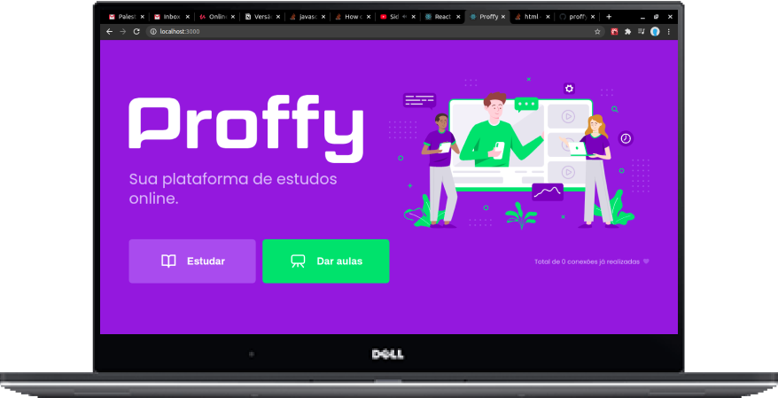

<h3 align="center">Plataforma web para conectar alunos e professores</h3> 
<h4 align="center">Projeto da Next Level Week #2, da <a href="https://rocketseat.com.br/">Rocketseat</a></h4>

<h2>:memo: Funcionalidades:</h2>
<ul>
  <li>Cadastro de professores</li>
  <li>Registro de cronograma com disciplina e horários</li>
  <li>Buscar professores filtrados por:
    <ul>
      <li>Disciplina</li>
      <li>Dia da semana</li>
      <li>Horário</li>
    </ul>
  </li>
  <li>Contato via Whatsapp (redirecionamento)</li>
</ul>

<h2>:computer: Principais tecnologias utilizadas:</h2>
<h3>Frontend:</h3>
<ul>
  <li>HTML5 + CSS3</li>
  <li>Typescript</li>
  <li>React</li>
</ul>
<h3>Backend:</h3>
<ul>
  <li>Node</li>
  <li>Express</li>
  <li>Knex + Sqlite</li>
</ul>
